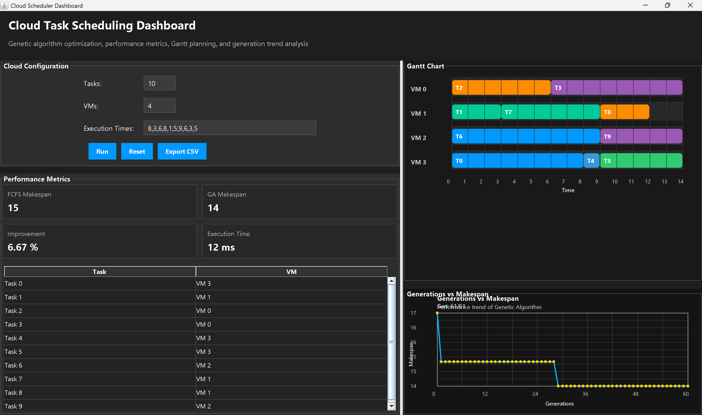

# Cloud Task Scheduling using Genetic Algorithm

## Overview

This project implements an optimized cloud task scheduling system using a Genetic Algorithm (GA). The system assigns tasks to virtual machines (VMs) in a way that minimizes execution time (makespan) and improves resource utilization. It also compares the performance of GA with the traditional First Come First Serve (FCFS) scheduling algorithm.

The application includes a graphical user interface (GUI) built using Java Swing, along with visualization features such as performance graphs and Gantt charts.

---

## Features

* Genetic Algorithm based task scheduling
* FCFS scheduling for comparison
* Makespan optimization
* Graph visualization (Generations vs Makespan)
* Gantt chart for task allocation
* Dark-themed dashboard UI
* Input validation and error handling
* CSV export functionality

---

## Technologies Used

* Java (Core Java)
* Java Swing (GUI)
* Object-Oriented Programming
* Genetic Algorithm

---

## Project Structure

```
CloudScheduler/
│
├── src/
│   ├── main/
│   │   ├── App.java
│   │   ├── model/
│   │   ├── algorithm/
│   │   ├── service/
│   │   ├── utils/
│   │   └── gui/
│
├── data/
├── README.md
```

---

## How It Works

1. User provides:

   * Number of tasks
   * Number of virtual machines
   * Execution time of tasks

2. The system:

   * Runs FCFS scheduling
   * Runs Genetic Algorithm optimization

3. Output:

   * Displays makespan comparison
   * Shows task allocation
   * Visualizes results using graph and Gantt chart

---

## Genetic Algorithm Workflow

* Initialize population
* Evaluate fitness (based on makespan)
* Selection (tournament method)
* Crossover
* Mutation
* Repeat for multiple generations
* Select best solution

---

## Execution Steps

### Compile

```
javac -d out src\main\*.java src\main\gui\*.java src\main\algorithm\*.java src\main\model\*.java src\main\service\*.java src\main\utils\*.java
```

### Run

```
java -cp out main.App
```

---

## Example Input

```
Tasks: 3
VMs: 2
Execution Times: 10,20,30
```

---

## Example Output

* FCFS Makespan: 60
* GA Makespan: 50
* Improvement: 20%

---

## Advantages

* Reduces execution time
* Improves resource utilization
* Provides visual analysis
* Scalable approach

---

## Limitations

* Performance depends on GA parameters
* Not connected to real cloud environment
* Static input-based simulation

---

## Future Scope

* Integration with real cloud platforms
* Web-based dashboard
* AI-based scheduling techniques
* Database integration
* Real-time monitoring

---

## Author

Sangam Verma
B.Tech Computer Science Engineering

---

## License

This project is for academic use only.



<video controls src="ppt v.mp4" title="project exicution vidio"></video>